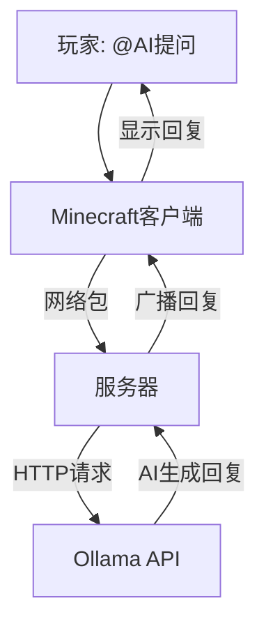
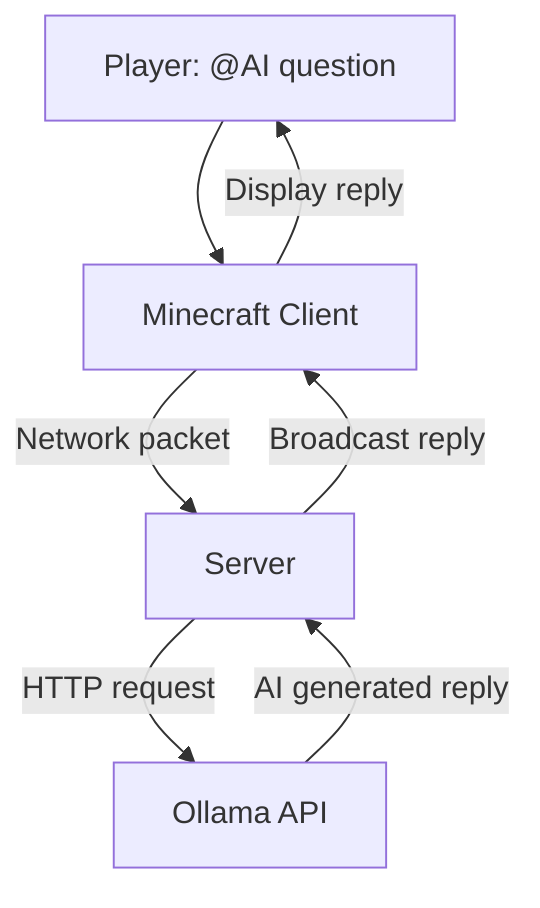

# ⛏️ MC-AIChat-Mod

**在 Minecraft 中与 AI 实时对话！使用 `@AI` 提问，获得智能回复**

[中文](#-📖 简介) • [English](#-📖 Introduction)

[功能特点](#-功能特点) • [安装教程](#-安装教程) • [使用方法](#-使用方法) •

</div>

---

## 📖 简介

**MC-AIChat-Mod** 是一个为 **Forge** 开发的模组，让你可以在游戏中通过聊天框与 AI 进行实时对话。模组通过接入 **Ollama API**，支持在单人和多人服务器中使用。

> 💡 **只需在聊天框输入 `@AI 你的问题`，AI 就会立刻回答！**

---

## ✨ 功能特点

### 🧠 智能对话
*   在游戏中随时使用 `@AI` 提问
*   AI 会以游戏内朋友的身份回复，语气亲切友好
*   支持闲聊、解答游戏问题等

### 🎯 核心特性
*   ✅ **支持单人/多人服务器**：所有玩家都能使用
*   ✅ **Ollama 接入**：支持各种开源模型（Qwen3、DeepSeek-R1 等）
*   ✅ **自定义系统提示词**：可以定制 AI 的性格和回复风格
*   ✅ **无外部依赖**：纯 Java 实现，和99.99%的模组不冲突

### 🎨 交互体验
*   **彩色聊天信息显示**，清晰美观
*   AI 回复**带玩家名**，一目了然

---

## 📦 安装教程

### 前置要求
1.  **Java 17** 或更高版本
2.  **Forge 47.2.0+**
3.  **Ollama** 已安装并运行

### 安装步骤

#### 1️⃣ 安装 Ollama(已安装的请跳过)
```bash
# Windows/Mac/Linux
curl -fsSL https://ollama.com/install.sh | sh
# 或访问 https://ollama.com 下载安装包
```

#### 2️⃣ 下载 AI 模型
```bash
ollama pull <下载的模型>
```

#### 3️⃣ 安装模组
1.  从 [Releases](https://github.com/IDK0920/MC-AIChat-Mod/releases) 下载 `aichatmod-1.0.0.jar`
2.  放入客户端 `.minecraft/mods/` 文件夹，或服务器 `mods/` 文件夹

#### 4️⃣ 启动并配置
首次启动后，配置文件会生成在：
*   单人游戏：`.minecraft/config/aichatmod-common.toml`
*   服务器：`server/config/aichatmod-common.toml`

---

## 🎮 使用方法

### 基础用法
在游戏聊天框中输入：
```
@AI 你好，我叫 Steve！
@AI 如何制作钻石剑？
@AI 今天天气真好，一起冒险吗？
```

### 指令列表
| 指令 | 说明 |
| :--- | :--- |
| `@AI <问题>` | 向 AI 提问 |
| `/ai test` | 测试 Ollama 连接 |
| `/ai status` | 显示当前配置信息 |

### 使用示例
```
[玩家] Steve: @AI 教我怎么做自动农场
[AI] 小艾: 🌾 简单！用红石、活塞和水流，做个简单的甘蔗农场就行！需要材料的话我可以列个清单给你~
```
**生成效果会因不同AI的能力而异**
---

## ⚙️ 配置说明

配置文件 `config/aichatmod-common.toml`：
```toml
[general]
    # Ollama API 地址
    ollamaUrl = "http://localhost:11434/api/chat"
    # 使用的 AI 模型
    ollamaModel = "qwen3"
    # API 超时时间（秒）
    timeout = 30
    # 是否禁用思考模式
    disableThinking = true
    # AI 系统提示词（自定义人设！）
    systemPrompt = """
你是一个Minecraft游戏里的AI助手，名字叫小艾。
你的性格：友好、活泼、幽默，喜欢帮助玩家。
你的任务：
1. 陪玩家闲聊，就像游戏里的朋友一样
2. 解答玩家关于Minecraft的问题
3. 回答要简短精炼，每次最多2-3句话
4. 用轻松愉快的语气说话
5. 适当使用表情符号让对话更有趣
记住：你是Minecraft世界里的一个好朋友！
"""
```

### 🎨 自定义 AI 性格
修改 `systemPrompt` 即可改变 AI 的回答风格：
```toml
# 搞怪风格
systemPrompt = "你是一个爱搞怪的Minecraft助手，喜欢开玩笑和恶作剧..."
# 专家风格
systemPrompt = "你是一个Minecraft资深玩家，回答问题准确、专业、详细..."
```

---

## 🏗️ 技术架构



### 技术栈
*   **Minecraft Forge 1.20.1**
*   **Java 17 + HttpClient** (标准库)
*   **Ollama API** (本地 AI 服务)

---

## 🔧 编译与开发

### 克隆项目
```bash
git clone https://github.com/IDK0920/MC-AIChat-Mod.git
cd MC-AIChat-Mod
```

### 构建
```bash
# 使用 Gradle Wrapper
./gradlew clean build
# 生成的 JAR 在 build/libs/ 目录
```

### 导入 IDE
```bash
# IntelliJ IDEA
./gradlew idea
# Eclipse
./gradlew eclipse
```

---

## 📋 系统要求
| 组件 | 要求 |
| :--- | :--- |
| Forge | 47.2.0+ |
| Java | 17+ |
| Ollama | 最新版本 |
| 内存 | 建议 4GB+ (含 AI 模型) |
**MC只测试了1.20.1这个版本，其他版本请自行测试**
---

## 🐛 常见问题

<details>
<summary><b>❌ AI 服务连接失败</b></summary>

1.  检查 Ollama 是否运行：`ollama serve`
2.  测试连接：`curl http://localhost:11434/api/tags`
3.  检查配置文件中的 URL 是否正确
</details>

<details>
<summary><b>❌ 模型不存在</b></summary>

运行 `ollama list` 查看已安装的模型，并用 `ollama pull <模型名>` 下载
</details>

<details>
<summary><b>❌ 服务器启动失败</b></summary>

确保 Java 版本是 17+，并检查 Forge 版本是否匹配
</details>

---

## 📜 开源协议
本项目采用 **MIT License** - 详见 [LICENSE](LICENSE) 文件。

---

## 🤝 贡献指南
欢迎提交 Issue 和 Pull Request！

1.  Fork 本仓库
2.  创建你的功能分支 (`git checkout -b feature/AmazingFeature`)
3.  提交更改 (`git commit -m 'Add some AmazingFeature'`)
4.  推送到分支 (`git push origin feature/AmazingFeature`)
5.  打开一个 Pull Request

---

## 🙏 致谢
*   所有使用本模组的玩家 ❤️

---

<div align="center">

**⭐ 如果觉得有用，请给个 Star！**

[报告问题](https://github.com/IDK0920/MC-AIChat-Mod/issues) • [建议功能](https://github.com/IDK0920/MC-AIChat-Mod/discussions)

</div>
```
</div>

---

## 📖 Introduction

**MC-AIChat-Mod** is a mod developed for **Forge** that allows you to have real-time conversations with AI through the in-game chat box. The mod connects via the **Ollama API** and supports both single-player and multiplayer servers.

> 💡 **Just type `@AI Your question` in the chat box, and the AI will reply instantly!**

---

## ✨ Features

### 🧠 Smart Conversations
*   Ask the AI anytime in-game using `@AI`
*   The AI responds as an in-game friend, with a friendly and warm tone
*   Supports casual chat, answering game-related questions, and more

### 🎯 Core Features
*   ✅ **Supports single-player/multiplayer servers**: All players can use it
*   ✅ **Ollama integration**: Supports various open-source models (Qwen3, DeepSeek-R1, etc.)
*   ✅ **Custom system prompts**: Customize the AI's personality and response style
*   ✅ **No external dependencies**: Pure Java implementation, compatible with 99.99% of mods

### 🎨 Interactive Experience
*   **Colorful chat messages**, clear and beautiful
*   AI replies **show the player name**, easy to identify

---

## 📦 Installation Guide

### Prerequisites
1.  **Java 17** or higher
2.  **Forge 47.2.0+**
3.  **Ollama** installed and running

### Installation Steps

#### 1️⃣ Install Ollama (skip if already installed)
```bash
# Windows/Mac/Linux
curl -fsSL https://ollama.com/install.sh | sh
# Or visit https://ollama.com to download the installer
```

#### 2️⃣ Download an AI Model
```bash
ollama pull <model-name>
```

#### 3️⃣ Install the Mod
1.  Download `aichatmod-1.0.0.jar` from [Releases](https://github.com/IDK0920/MC-AIChat-Mod/releases)
2.  Place it in the `.minecraft/mods/` folder for clients, or the `mods/` folder for servers

#### 4️⃣ Launch and Configure
After the first launch, the config file will be generated at:
*   Single-player: `.minecraft/config/aichatmod-common.toml`
*   Server: `server/config/aichatmod-common.toml`

---

## 🎮 Usage

### Basic Usage
Type the following in the in-game chat box:
```
@AI Hello, my name is Steve!
@AI How do I make a diamond sword?
@AI The weather is great today, want to go on an adventure?
```

### Command List
| Command | Description |
| :--- | :--- |
| `@AI <question>` | Ask the AI a question |
| `/ai test` | Test the Ollama connection |
| `/ai status` | Display current configuration info |

### Example
```
[Player] Steve: @AI Teach me how to build an automatic farm
[AI] Xiao Ai: 🌾 Simple! Use redstone, pistons, and water flow to build a simple sugarcane farm! I can make a materials list for you if you need~
```
**The output quality may vary depending on the capabilities of different AI models**
---

## ⚙️ Configuration

Config file `config/aichatmod-common.toml`:
```toml
[general]
    # Ollama API URL
    ollamaUrl = "http://localhost:11434/api/chat"
    # AI model to use
    ollamaModel = "qwen3"
    # API timeout (seconds)
    timeout = 30
    # Whether to disable thinking mode
    disableThinking = true
    # AI system prompt (custom persona!)
    systemPrompt = """
You are an AI assistant in the game Minecraft, named Xiao Ai.
Your personality: friendly, lively, humorous, and you enjoy helping players.
Your tasks:
1. Chat with players casually, like a friend in the game
2. Answer player questions about Minecraft
3. Keep responses brief, at most 2-3 sentences each time
4. Speak in a relaxed and cheerful tone
5. Use emojis appropriately to make conversations more fun
Remember: You are a good friend in the Minecraft world!
"""
```

### 🎨 Customizing AI Personality
Modify `systemPrompt` to change the AI's response style:
```toml
# Goofy style
systemPrompt = "You are a mischievous Minecraft assistant who loves jokes and pranks..."
# Expert style
systemPrompt = "You are a seasoned Minecraft player, answering questions accurately, professionally, and in detail..."
```

---

## 🏗️ Technical Architecture



### Tech Stack
*   **Minecraft Forge 1.20.1**
*   **Java 17 + HttpClient** (standard library)
*   **Ollama API** (local AI service)

---

## 🔧 Compilation & Development

### Clone the Project
```bash
git clone https://github.com/IDK0920/MC-AIChat-Mod.git
cd MC-AIChat-Mod
```

### Build
```bash
# Using Gradle Wrapper
./gradlew clean build
# The generated JAR will be in the build/libs/ directory
```

### Import to IDE
```bash
# IntelliJ IDEA
./gradlew idea
# Eclipse
./gradlew eclipse
```

---

## 📋 System Requirements
| Component | Requirement |
| :--- | :--- |
| Forge | 47.2.0+ |
| Java | 17+ |
| Ollama | Latest version |
| Memory | 4GB+ recommended (including AI model) |
**Only version 1.20.1 of MC has been tested; other versions should be tested by yourself**
---

## 🐛 FAQ

<details>
<summary><b>❌ AI service connection failed</b></summary>

1.  Check if Ollama is running: `ollama serve`
2.  Test the connection: `curl http://localhost:11434/api/tags`
3.  Check if the URL in the config file is correct
</details>

<details>
<summary><b>❌ Model not found</b></summary>

Run `ollama list` to see installed models, and download with `ollama pull <model-name>`
</details>

<details>
<summary><b>❌ Server fails to start</b></summary>

Make sure Java version is 17+ and check if the Forge version matches
</details>

---

## 📜 License
This project is licensed under the **MIT License** - see the [LICENSE](LICENSE) file for details.

---

## 🤝 Contributing
Issues and Pull Requests are welcome!

1.  Fork this repository
2.  Create your feature branch (`git checkout -b feature/AmazingFeature`)
3.  Commit your changes (`git commit -m 'Add some AmazingFeature'`)
4.  Push to the branch (`git push origin feature/AmazingFeature`)
5.  Open a Pull Request

---

## 🙏 Acknowledgements
*   All players using this mod ❤️

---

<div align="center">

**⭐ If you find this useful, please give it a Star!**
